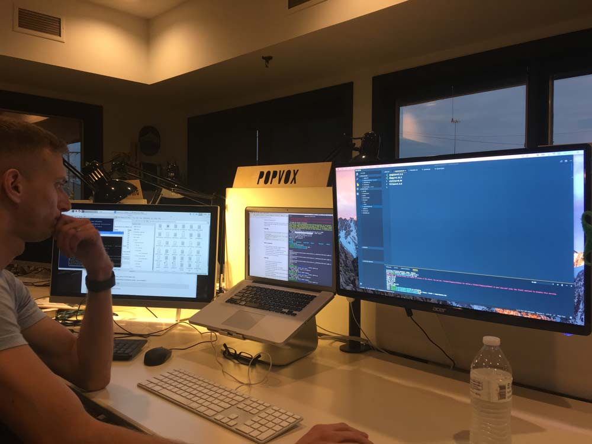
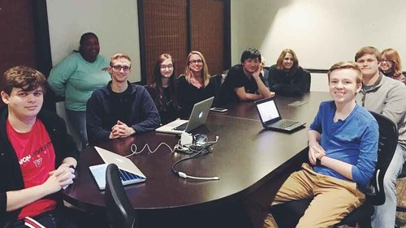
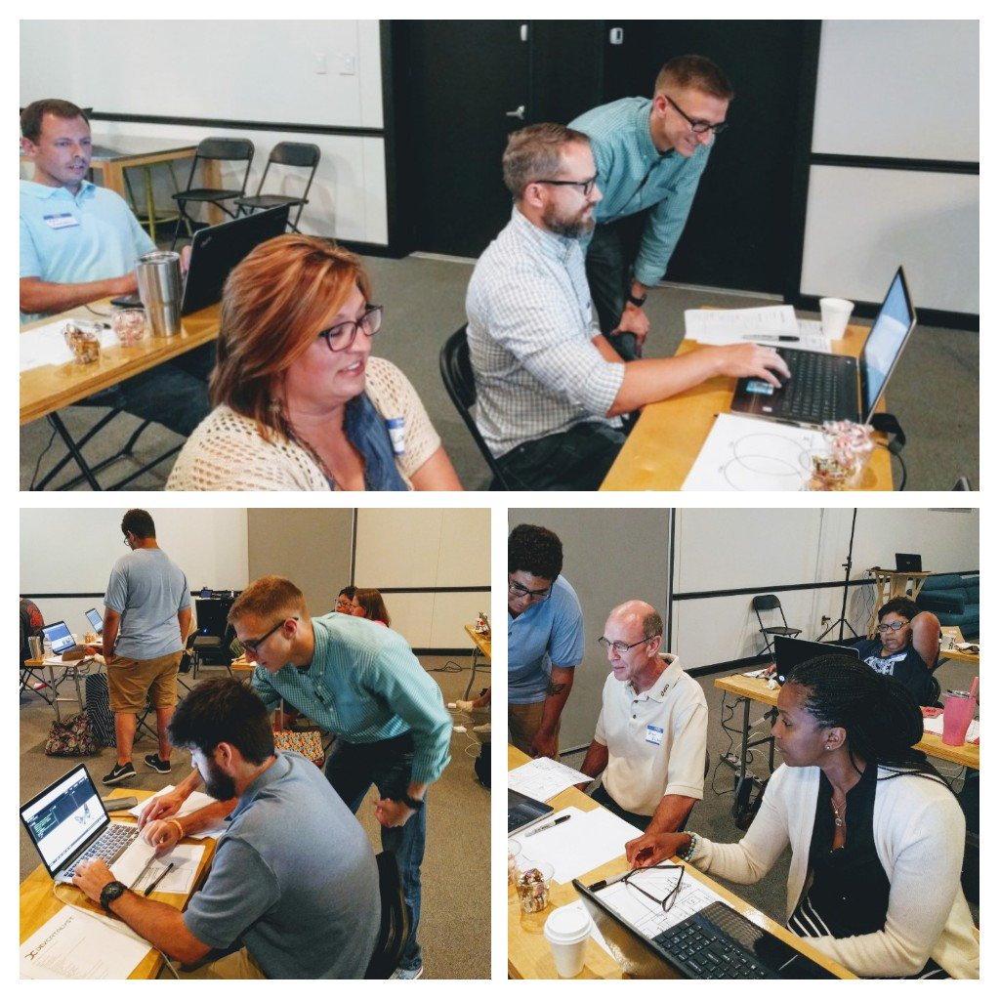
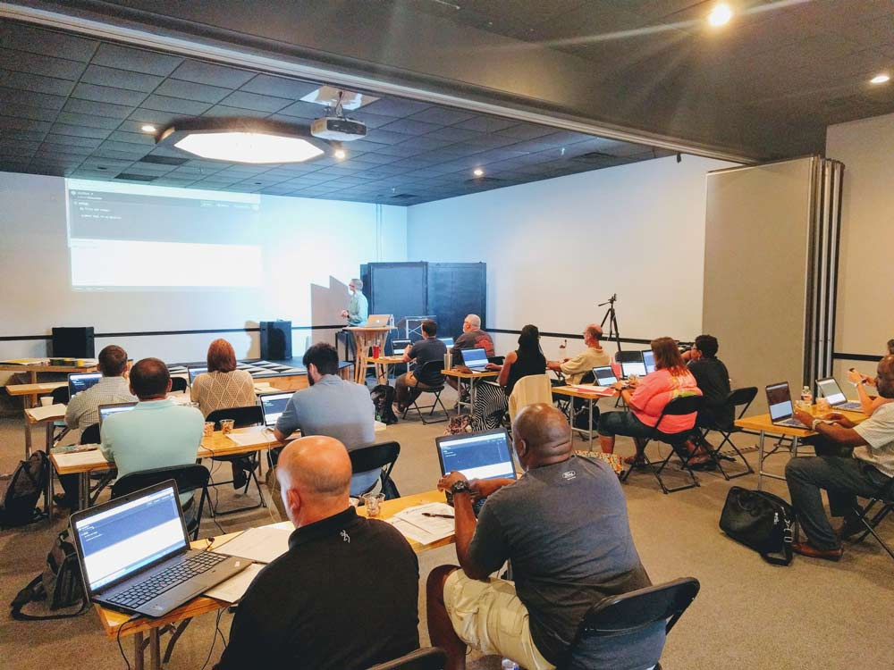
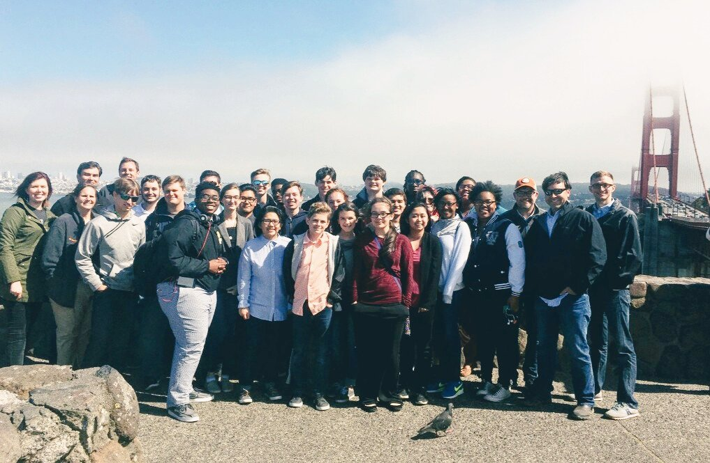
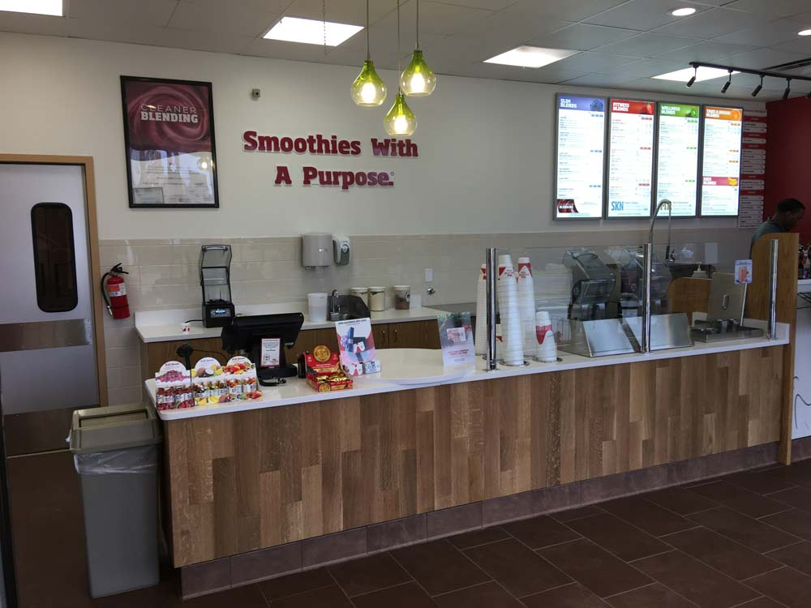
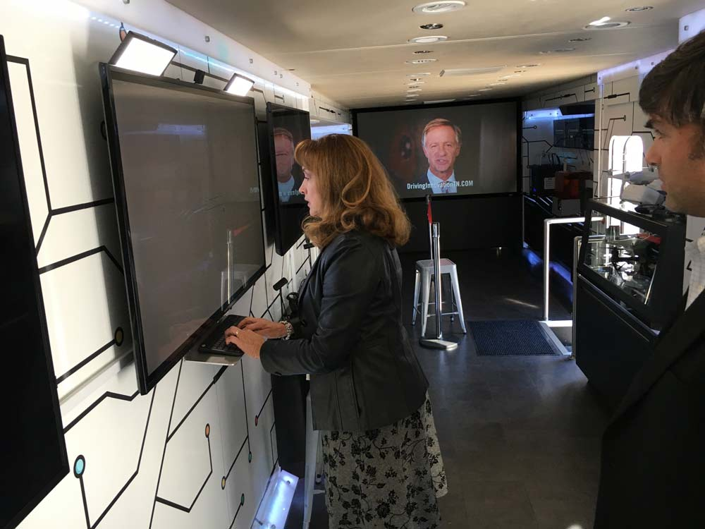

With goals set last year, and 12 months past, let's see what my 2017 looked like.

# Goals set for 2017

- [x] lead a meetup
- [x] teach coding workshops
- [x] attend 2 conferences
- [ ] 3 books a month
- [x] mentor new coders
- [x] 7 streams of income

_Time tracking metrics first:_
tracked in [Toggl](https://toggl.com/)

- 1988 hours with Sodium Halogen
- 120 hours with Smoothie King
- 310 hours from extra work

This is totalling to 60 five-day work weeks. 😣 🤑

---

## Income streams

Boom! We did it.

#### Me:

- [Sodium Halogen](http://sodiumhalogen.com) - lead developer
- [Smoothie King](http://smoothieking.com) - project management
- [Wolfgang Computer](http://wolfgangcomputer.com) - 6 websites/apps/computers
- [Dev.Catalyst](https://www.attheco.com/devcatalyst) videos\*
- [Dev.Catalyst](https://www.attheco.com/devcatalyst) workshop\*
- [theCO](attheco.com) Buses - photobooth in Python\*
- [theCO](attheco.com) Workshops\*

#### Molly ([wife](https://twitter.com/MissMollyAnn)):

- Fellowship Bible Church - worship academy
- Piano/Voice lessons

\* temporary/intermittent

---

## 3 Books a month

This goal was a fail (learning experience). 😜

I got stuck on "Bringing Up Boys" for the longest. Dr. Dobson has a ton of examples for parenting, but took such an emotional toll to read the book.

- "Bringing Up Boys" by Dr. James Dobson
- "10X Rule" by Grant Cardone
- "The Life-Changing Magic of Tidying Up" by Marie Kondo
- "The End of Jobs: Money, Meaning and Freedom Without the 9-to-5" by Taylor Pearson
- "The One Minute Manager Meets the Monkey" by Kenneth Blanchard

---

## Lead a meetup

I had the oppurtunity to lead the [CO:de meetup](http://code.attheco.com) every month. There has been an average of 10 people for each meetup.

I've done _20 videos_ for CO:de and some of which have been used for the Dev.Catalyst program.
https://www.youtube.com/playlist?list=PLnmaTbl4XQyQfwDVYnq9q5Tf4pNdl1Dh1

---

## Teach coding

This year I have created a workshop for beginner web developers that I've lead 4 times this year to _40+ people_.

---

## Attend 2 conferences

- [C4TK](http://codeforthekingdom.org/): Code 4 The Kingdom (won hackathon 2nd year in a row)
- [Nodevember](http://nodevember.org/) (5th time to attend)
- signed up for Python conf for 2018 - [PyTN](https://www.pytennessee.org/)

## Mentor new coders

With my solo intro into coding, it was a challenging beginning. I was hoping I could encourage others into the industry and share my experience and knowledge.

The workshops, leading a meetup, and now mentoring a couple members in Sodium Halogen, it's been a good year. I've also been meeting with a biology grad from Union University that is wanting to make the switch into developement. We've been meeting weekly for a few hours on Wednesday at 6am. He's been killing it. I've been very-very impressed. Keep it up, Zach the Coder!

## Unexpected wins

- went to San Fransico with Dev.Catalyst team and competition winning students 😮 👍
- learned a good bit about cryptocurrencies
- made a average 13% ROI on each crypto investment with a total of 105% ROI
- practiced a good bit with ReactJS and VueJS (Javascript frameworks)

## Progress made

Some wins along the way...

- healthy and happy family
- bought 2 vehicles in a 3 month period (no more please)
- Sodium Halogen completed 6+ projects

Smoothie King got a remodel

Python Photo booth - 80 hours in 1 month along side Sodium Halogen work.

## Warp up

I recommend everyone set goals and keep track. This has been very insightful.

Now I need to set my goals for next year. Join me. 😊

If you liked this or want to chat, [get in touch with me](https://twitter.com/Chance_Smith).
