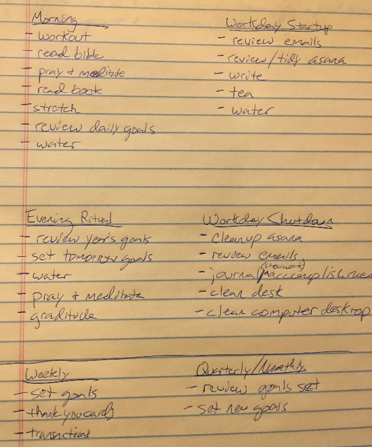

Making progress every single day. To look back 90 days and see a good record of effort and a ton of work done, that would be awesome!

After reading ["The Compound Effect" by Darren Hardy](http://amzn.to/2CzeXC8) (a must read), it was clear that I needed to be more consistent with my actions for reaching the goals I had set. With this new year I want to reach my goals. I want to stay focused. I want this to be the best year yet.

Focus...that means I need to keep my goals front of mind. I need to review them. I need a system.

I needed to stop drifting and to stop being so drivin.

| "Drifing and being drivin both lead to burnout" - Michael Hyatt

Routines can help with this. For us to succeed we'll need routines that will be simple and rewarding. Let's do it! 🏃‍♂️🏃‍♀️

# Daily Routines

## Morning

- drink 2 glasses of water (16oz)
- workout
- pray &amp; meditate
- read bible
- stretch
- read
- review today's goals

## Workday start

- water & tea on desk
- charge my watch
- write (jounral, blog post, ideas, share progress)
- review/reply-to emails
- review/revise tasks (Asana)

## Workday end

- review/reply to any last minute emails
- tidy up tasks for tomorrow (Asana)
- write (jounral, blog post, ideas, share progress)
- clean desk &amp; Mac desktop
- text Molly I'm on my way home from [theCO](http://attheco.com)

## Evening

- review yearly/weekly goals
- set goals for tomorrow
- read
- teeth
- 16oz of water down the hatch
- pray

Here's my rough draft before typing and ordering:

## Warp up

My overarching goals are to: read more 📚, share progress 🎤, more fit 💪, and more focused 👀.

I was able to make these routines by listing out the items I wanted to make progress on everyday.

I'm excited about 2018 and hoping to make it fun and memorable. Here we go...day one.

If you liked this or want to chat, [get in touch with me](https://twitter.com/Chance_Smith).
